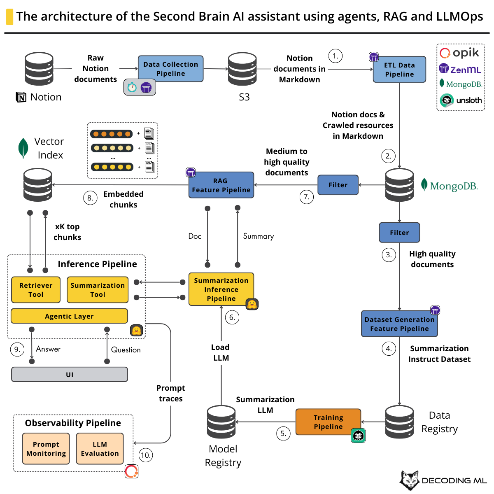
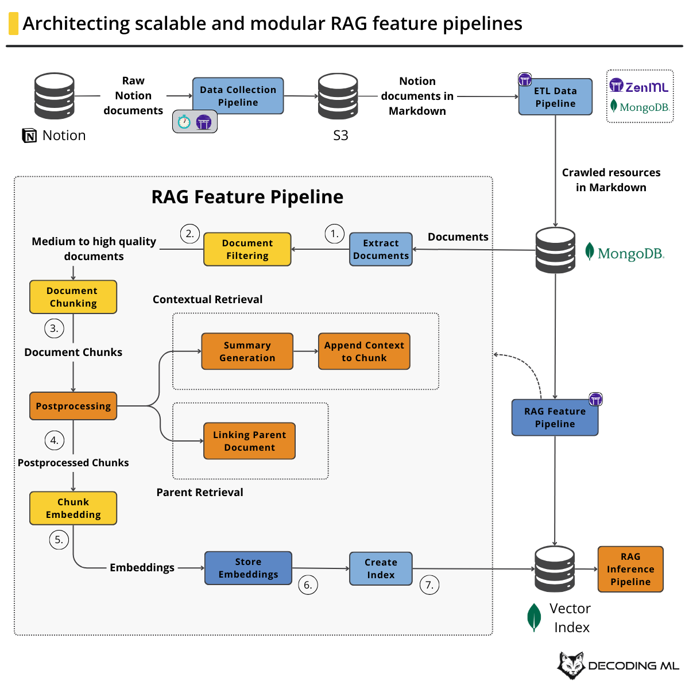
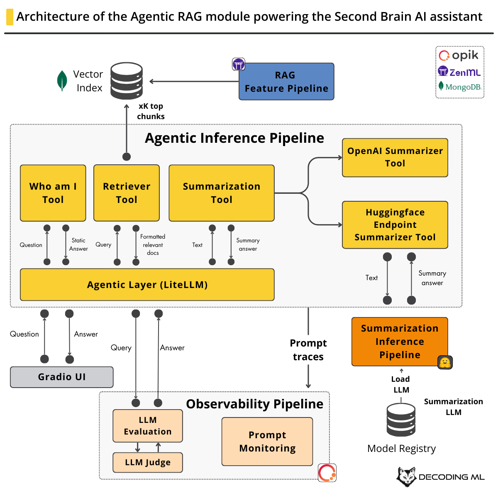
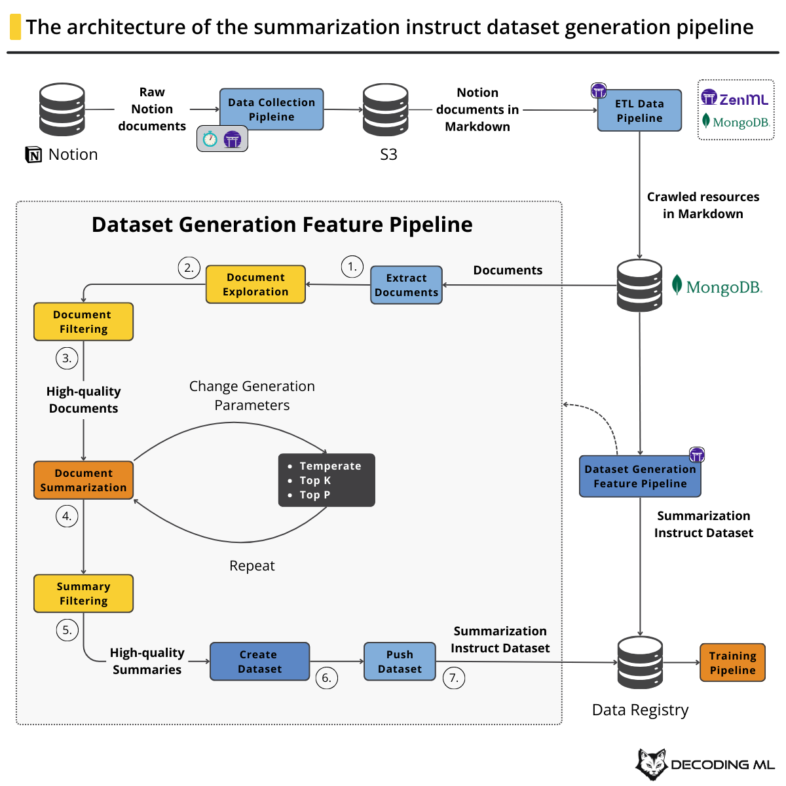
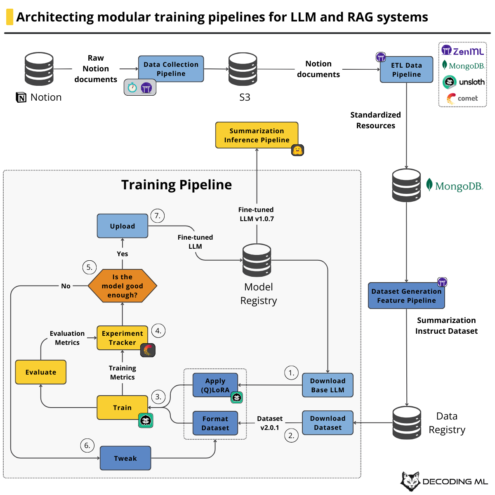
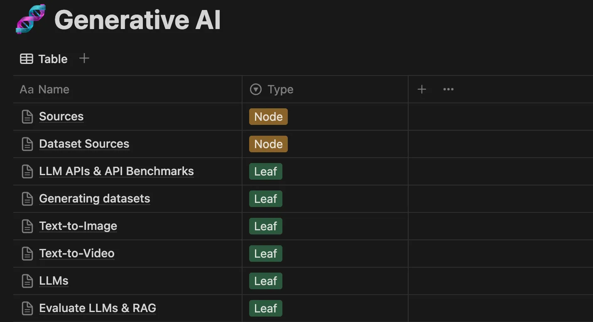

# Building Your Second Brain AI Assistant Using Agents, LLMs and RAG

This project has been inspired by the course [Building Your Second Brain AI Assistant Using Agents, LLMs and RAG](https://github.com/decodingml/second-brain-ai-assistant-course/tree/main) from [Decoding ML](https://decodingml.substack.com/).


<p align="center">
  <a href="https://decodingml.substack.com/p/build-your-second-brain-ai-assistant">
    
  </a>
</p>


This project contains the code for building a production-ready GenAI systems using LLMs, RAG, agents and LLMOps.
It uses advanced RAG and LLM system using LLMOps and ML systems best practices.


## What Is the Second Brain AI Assistant?

The Second Brain, a concept by Tiago Forte, is your personal knowledge base of notes, ideas, and resources. Our AI Assistant leverages this knowledge to answer questions, summarize documents, and provide insights.

While we use Notion for this project, the code is adaptable to other sources like Google Drive or Calendar.
The author of the course provided a curated AI/ML resource list from Notion, covering GenAI, LLMs, RAG, MLOps, and more. **No Notion account needed** - but if you want to use yours, our flexible pipeline supports any Notion database.

<table>
  <tr>
    <td align="center" width="50%">
        
    </td>
    <td align="center" width="50%">
        
    </td>
  </tr>
</table>


## Key features

- LLM system architecture (FTI) and MLOps best practices
- Industry tools: OpenAI, Hugging Face, MongoDB, ZenML, Opik, Comet, Unsloth, and more
- Pipeline orchestration and tracking with ZenML
- LLMOps and RAG evaluation using Opik
- Large-scale web crawling and content normalization using Crawl4AI
- Quality scoring with LLMs and heuristics
- Dataset generation through distillation
- Llama model fine-tuning with Unsloth and Comet
- Serverless model deployment to Hugging Face
- Advanced RAG with contextual or parent retrieval and vector search
- Agent building using smolagents
- Modern Python tooling (uv, ruff)

<table>
  <tr>
    <td align="center" width="50%">
        
    </td>
    <td align="center" width="50%">
        
    </td>
  </tr>
</table>


## Cost Structure

You'll only need $1-$5 for tools to run the code:

| Service | Maximum Cost |
|---------|--------------|
| OpenAI's API | ~$3 |
| Hugging Face's Dedicated Endpoints (Optional) | ~$2 |


## Project Structure

While building the Second Brain AI assistant, we will build two separate Python applications:

```bash
.
├── infrastructure/           # Docker infrastructure for the applications
├── offline-pipeline/         # Offline ML pipelines
└── online-pipeline/          # Online inference pipeline = our AI assistant
```

## Dataset

We used the author's personal list of filtered resources (which he kept in Notion) on AI and ML, such as GenAI, LLMs, RAG, MLOps, LLMOps and information retrieval, containing ~100 pages and 500+ links which we will crawl and access from the Second Brain AI assistant.



For ease of use, the author stored a snapshot of his Notion data in a public S3 bucket, which you can download for free without AWS credentials.

[Download the data here](https://decodingml-public-data.s3.eu-central-1.amazonaws.com/second_brain_course/notion/notion.zip)

**Thus, you don't need to use Notion or give access to your Notion to complete this course.** But if you want to, you can, as we expose in this GitHub repository, a flexible pipeline that can load any Notion database. 

## Getting Started

